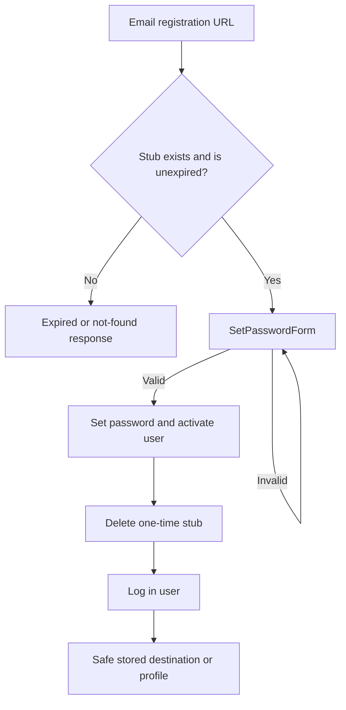

# feat: Complete self-service registration web UI

## Goal Capsule

- **Objective:** Let a user who receives a self-service registration email set a password, activate the pre-created account, and continue to the safe stored destination.
- **Authority:** Issue #80, implemented on top of the existing user-stub and Discord-registration work. Issue #27 provides the expected self-service registration flow context.
- **Scope:** Add only the completion UI and request lifecycle. The existing bot/email creation path and data migration remain the authority for creating registration stubs.

---

## Product Contract

### Summary

Finish the web side of the registration flow already created by the branch.
The emailed registration URL will show a password form for a valid, unexpired `UserStub`.
Successful submission activates the account, signs the user in, deletes the one-time stub, and redirects only to the stored local destination or the normal profile page.

### Problem Frame

The Discord command and email notification create inactive users with expiring registration keys, but the current project has no URL, view, form, or template to consume that key.
Users therefore cannot complete the account registration that the email promises.

### Requirements

- R1. A registration URL at `/accounts/register/continue/<uuid>` must render a password setup page for a valid, unexpired user stub.
- R2. The page must require first and last name, use Django password validation, and require password confirmation.
- R3. A valid submission must persist the user name and password, activate the user, consume the stub, authenticate the session, and redirect to its validated post-registration destination or the profile page.
- R4. Unknown, consumed, or expired registration keys must not activate an account and must receive an appropriate not-found or expired response.
- R5. The form must preserve the existing anonymous-safe visual shell rather than using `newBase.html`, which assumes an authenticated request user.

### Scope Boundaries

- The flow does not add public registration-stub creation. The Discord and management-command paths continue to create and email stubs.
- The flow does not redesign login, account profile editing, or email delivery.
- Rate limiting and a resend UI are deferred because the existing creation path already controls issuance and expiry.

### Acceptance Examples

- AE1. Given a valid registration key, when the recipient submits matching valid passwords, then their user becomes active, they are logged in, and the key can no longer be used.
- AE2. Given a valid registration key with `/payments/` as its stored destination, when registration succeeds, then the browser redirects to `/payments/`.
- AE3. Given an expired registration key, when the recipient opens its URL, then no password form is shown and no account state changes.

---

## Planning Contract

### Key Technical Decisions

- KTD1. **Extend `SetPasswordForm` for registration completion.** The form requires the missing first and last name while preserving Django’s password validation and confirmation. Governs R2, R3.
- KTD2. **Treat the `UserStub` as the single-use token record.** Check expiry before rendering or posting, and call `activate()` only after the password is stored. Governs R1, R3, R4.
- KTD3. **Log the user in immediately after activation.** The emailed link is a possession factor for the temporary inactive account, so requiring a second sign-in step is unnecessary. Governs R3.
- KTD4. **Ship through the GitHub stack workflow.** The user directed `gh stack submit` to create/update stacked PRs, with `gh stack sync` used for synchronization; a normal `gh pr create` flow is not used.

### High-Level Technical Design

### Assumptions

- The registration-completion UI requested by issue #80 is the final step for the `UserStub` backend on this branch.
- The existing `after_registration_redirect_destination` validation remains the redirect safety boundary.

---

## Implementation Units

### U1. Registration completion request lifecycle

- **Goal:** Add a view and URL that safely loads, validates, and consumes user stubs.
- **Requirements:** R1, R3, R4.
- **Dependencies:** None.
- **Files:** `accounts/views.py`, `accounts/urls.py`, `accounts/tests.py`.
- **Approach:**
  1. Resolve the stub by UUID and reject expired records before showing the form.
  2. Bind the registration-completion form to the stub’s inactive user on POST.
  3. On success, persist the first name, last name, and password, activate and consume the stub, log in the user, then redirect to its stored safe destination or `profile`.
  4. Avoid partial activation by keeping the state transition coherent if form processing fails.
- **Patterns to follow:** Existing class-based account views in `accounts/views.py`; redirect handling in `UserStub.activate()`; Django authentication URL integration in `clubManager/urls.py`.
- **Test scenarios:**
  - Covers AE1. A valid key renders the setup form and matching valid names and password activate and log in the associated user.
  - Covers AE2. A successful submission redirects to the stub’s stored local destination.
  - A successful submission without a destination redirects to the named profile route.
  - Missing names or an invalid or mismatched password leave the stub and inactive user intact and re-render form errors.
  - Covers AE3. An expired key is rejected on GET and POST without activating the user.
  - A consumed or unknown key is rejected and cannot establish a session.
- **Verification:** Request-level tests prove each lifecycle outcome and no valid stub survives successful activation.

### U2. Anonymous registration completion page

- **Goal:** Provide a clear form page that can be rendered before authentication.
- **Requirements:** R1, R2, R5.
- **Dependencies:** U1.
- **Files:** `accounts/templates/registration_complete.html`, `accounts/tests.py`.
- **Approach:**
  1. Use a small standalone template that includes CSRF protection and password form non-field and field errors.
  2. Show the configured organization name when server settings exist, without relying on authenticated navigation.
  3. Keep page copy focused on choosing a password and completing account creation.
- **Patterns to follow:** Existing account templates in `accounts/templates/`; password/auth templates under `templates/registration/`.
- **Test scenarios:**
  - The valid-key page contains the password and confirmation fields plus CSRF protection.
  - Invalid submissions render actionable validation errors.
  - The anonymous page does not require the authenticated `newBase.html` layout context.
- **Verification:** View tests render the anonymous template under an unauthenticated client and assert the expected form behavior.

---

## Verification Contract

| Scope | Command | Done signal |
| --- | --- | --- |
| Registration lifecycle | `pipenv run python manage.py test accounts` | All existing and new `accounts` tests pass. |
| Project regression | `pipenv run python manage.py test` | Project test suite passes, or any pre-existing failure is documented. |
| Django checks | `pipenv run python manage.py check` | Django reports no configuration or model errors. |

---

## Definition of Done

- The email URL from `UserStub.get_registration_url()` resolves to a protected password setup experience.
- Successful registration activates, logs in, redirects, and permanently consumes the registration stub.
- Invalid, expired, and used keys cannot activate an account.
- Focused and project-level automated verification are recorded.
- The implementation is committed and sent through `gh stack submit`, creating or updating the stacked pull request.

---

## Sources / Research

- `accounts/models.py` contains the existing `UserStub` lifecycle, expiry, URL generation, redirect validator, and email notification.
- `discord_bot.py` provides the upstream Discord `/create` registration trigger and makes the current branch’s registration contract concrete.
- `accounts/views.py` and `accounts/urls.py` are the existing account web integration points.
- `core/templates/newBase.html` assumes an authenticated request and must not wrap the anonymous completion view.
