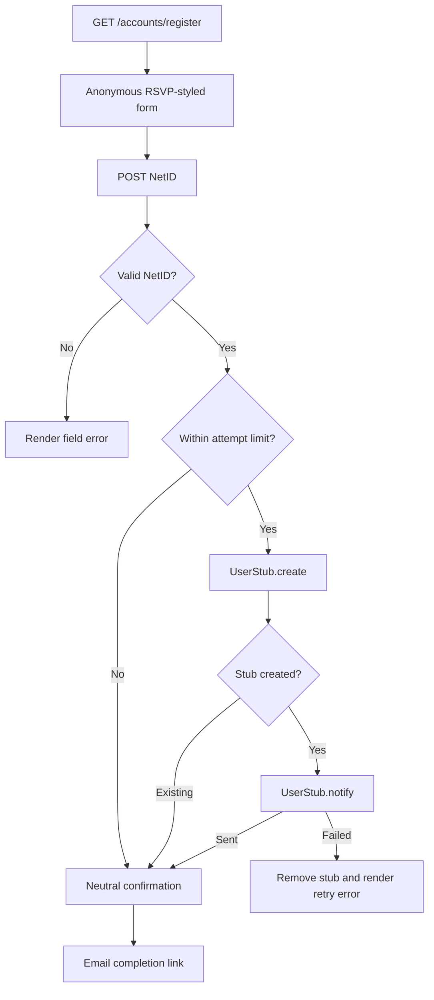

# feat: Add initial self-service registration page

## Goal Capsule

- **Objective:** A prospective member can start a self-service account registration from the web and receive the existing emailed completion link.
- **Means:** Add an anonymous NetID-only registration request page that reuses `UserStub` creation and notification behavior (KTD1).
- **Authority:** GitHub issues #81 and #27; the existing `UserStub` lifecycle and registration-completion UI on this branch.
- **Stop conditions:** Do not redesign the completion page, Discord registration, email delivery, or introduce a public redirect-destination parameter.

---

## Product Contract

### Summary

Issue #81 supplies the missing first step of the flow in issue #27: an anonymous visitor submits a NetID, the application sends the existing registration email, and the recipient continues through the already-built completion page.

### Problem Frame

The current branch can create a registration stub from Discord or a management command and can consume its email link, but users have no web route to initiate that flow.

### Requirements

- R1. `GET /accounts/register` renders an anonymous page with one NetID input and no authenticated navigation dependency.
- R2. `POST /accounts/register` normalizes and validates the NetID with the project's existing NetID rule before attempting registration.
- R3. For a valid NetID that can start registration, the request creates a `UserStub` with no post-registration redirect destination and sends its existing notification email.
- R4. The response after any validly-shaped registration attempt uses neutral wording so an unauthenticated requester cannot learn whether an account or active registration already exists.
- R5. Failed email delivery does not leave a usable incomplete account behind, and the user receives a retry-safe error response.
- R6. The page uses the RSVP page's card, header, field, button, error, and mobile styling vocabulary.
- R7. The public endpoint applies server-side limits before creating a stub or sending mail: five attempts per canonical client IP and two per normalized NetID during a 15-minute fixed window, returning neutral throttling feedback when either limit is exhausted.
- R8. The form labels its NetID input, associates and announces validation feedback, focuses the invalid input after a failed submission, and prevents repeated submission while a request is in progress.

### Key Flows

- F1. Start registration
  - **Trigger:** An anonymous visitor opens `/accounts/register` and submits a valid NetID.
  - **Steps:** Validate and normalize the input, create the registration stub, send its notification, and render a neutral confirmation.
  - **Outcome:** The recipient can open the emailed completion URL and finish registration.

### Scope Boundaries

- The page does not expose or accept an after-registration redirect destination.
- Existing Discord and management-command initiation flows remain unchanged.
- Email templates, CAPTCHA, and resend controls are deferred.

---

## Planning Contract

### Key Technical Decisions

- KTD1. **Reuse `UserStub.create()` and `UserStub.notify()` rather than duplicating lifecycle logic** (session-settled: user-directed — chosen over a new web-only registration implementation: the current branch is the required foundation). This preserves expiry, account conflict handling, email generation, and completion-page compatibility. Governs R3, R5.
- KTD2. **Share the established `NetIDField` validation pattern for the public form.** It lowercases input and applies the project NetID format before model or mail work. Governs R2.
- KTD3. **Return one neutral confirmation for successful and duplicate registration-shaped requests.** This limits unauthenticated account enumeration while preserving a usable retry message. Governs R4.
- KTD4. **Rate-limit before stub creation and email delivery.** Use Django's configured cache with separately scoped client-IP and normalized-NetID keys; each atomic counter starts at one with the fixed 15-minute expiry and blocks on either exhausted key. Production must use a shared atomic cache, while the canonical client IP is `REMOTE_ADDR` unless an explicit trusted-proxy configuration supplies it. Keep all throttled responses neutral. Governs R7.

### High-Level Technical Design

### Assumptions

- The public flow may send email only to `@utdallas.edu`, as `UserStub.notify()` already determines the recipient from the NetID.
- A generic confirmation is acceptable for already-active accounts and already-sent links because issue #81 does not require account-status disclosure.

---

## Implementation Units

### U1. Registration request form and view lifecycle

- **Goal:** Add the anonymous request endpoint that safely starts the existing registration flow.
- **Requirements:** R1, R2, R3, R4, R5, R7, R8.
- **Files:** `accounts/forms.py`, `accounts/views.py`, `accounts/urls.py`, `accounts/tests.py`, `clubManager/settings.py`.
- **Approach:** Add a NetID-only form using the existing validator; add a class-based GET/POST view; define the two limits and cache alias in settings; enforce atomic cache-backed IP and NetID counters with a 15-minute expiry before calling `UserStub.create(net_id, "")` and `UserStub.notify`; use `REMOTE_ADDR` except for a deliberately configured trusted-proxy source; handle known duplicate exceptions with a neutral confirmation; clean up a newly created user when notification fails.
- **Test scenarios:** A GET renders the public form; invalid NetIDs do not create a stub; a valid request creates a stub and notifies it; already-active and already-pending accounts render the neutral confirmation without sending another email; the sixth IP attempt and third NetID attempt in one window are blocked without creating a stub or sending mail; notification failure removes the new stub/user and returns a recoverable error; configuration tests document the production shared-cache and canonical-IP contract.
- **Verification:** Request tests mock mail-facing behavior and assert database state plus rendered response semantics.

### U2. RSVP-aligned initial registration page

- **Goal:** Make the initiation page visually consistent with the existing RSVP and final registration experiences.
- **Requirements:** R1, R6, R8.
- **Files:** `accounts/templates/registration_request.html`, `accounts/tests.py`.
- **Approach:** Extend `publicBase.html`; use the RSVP card/header/icon/form classes and responsive layout; present concise NetID and email-delivery guidance plus inline field and outcome messages; connect validation text to its input and focus it after an invalid POST; disable the submit control while submission is pending.
- **Test scenarios:** The anonymous response contains the NetID field, CSRF token, page copy, programmatic label/error association, and a renderable RSVP-derived card structure; invalid posts expose and focus the validation error; browser smoke confirms repeated submit prevention.
- **Verification:** Template assertions complement browser smoke evidence at desktop and narrow viewport sizes.

---

## Verification Contract

| Scope | Command | Done signal |
| --- | --- | --- |
| Focused behavior | `pipenv run python manage.py test accounts` | Registration request and existing completion tests pass. |
| Django integrity | `pipenv run python manage.py check` | No configuration or model errors. |
| Project regression | `pipenv run python manage.py test` | Full test suite passes or pre-existing failures are recorded. |
| Browser smoke | `ce-test-browser mode:pipeline` | The initial request page renders at desktop and mobile widths with RSVP-consistent styling. |

---

## Definition of Done

- `/accounts/register` renders a public NetID form and can initiate the existing email-backed registration workflow.
- Invalid input, duplicate states, and email failures have verified safe behavior.
- The page matches the RSVP visual treatment and has browser evidence captured for the pull request.
- Focused tests, Django checks, full tests, and browser verification are recorded.
- The resulting change is committed and submitted through `gh stack submit` as a draft stacked pull request.
